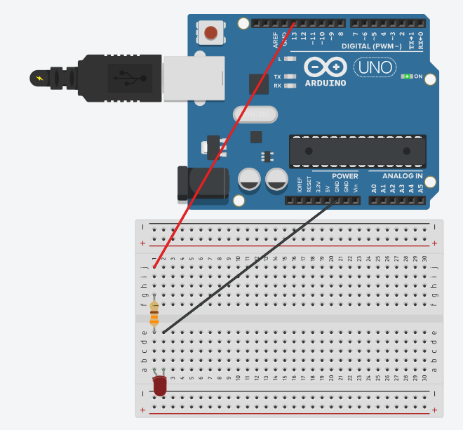

# Arduino Morse-Code Blinker

> Morse-code with a blinking LED

This is a first experiment with [Arduino](https://www.arduino.cc/) and [Johnny Five](http://johnny-five.io/).

## USAGE

## SETUP

## LICENSE

MIT © James Johnson
